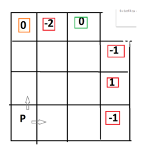

# North-or-East
 Created an agant which plays a zero-sum game against a human player

- The game is played on an NxN grid. N is a parameter chosen by the user. 
- The game board is initialized as shown in the image below. The (east and north) borders are initialized with random points [-2,-1,0,1,2].

 

- A single pawn is initialized at the position 0,0 in the game. 
- Each player has three possible moves (North, East, Pass) to reach one of border squares which have points.
- When the pawn reaches at a point square any player can win according to the point value:   the positive points are for Player 1. The negative points are for Player 2. 0 is a draw.
